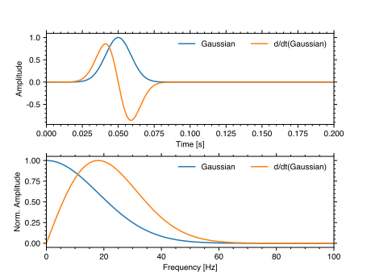

Seismology
----------

Just a set of function and scripts, I have created for figures that I like,
as well as other notes I deem important in terms of coding in seismology.

.. _station-map:

Plotting a good looking station map
+++++++++++++++++++++++++++++++++++

I have created a script that is working well for up to 10 networks with the 
default settings, which use matplotlib's ``tab10`` qualatative colormap.
For more networks, the :func:`lwsspy.plot_inventory` function takes in 
a colormap option which takes `x` colors for `x` networks sequentially from
a matplotlib colormap. A full script for writing the figure is shown below.

.. literalinclude:: figures/scripts/station_map.py
  :language: python

With the output:

.. image:: figures/station_map.svg

.. _ideal-stf:

Ideal Source Time Functions
++++++++++++++++++++++++++++++++

Just to be on the safe side and to not have to redo it all the time, I created
some functions that compute sourcetime functions with certain dominant
frequencies. 

**A Gaussian pulse**:

.. math::
    
    s(t) = e^{-{\left(4f_0  (t-t_0)\right)}^2}

**and its derivative**:

.. math::
    
    s(t) = -(8f_0) (t-t_0) e^{-{\left(4f_0  (t-t_0)\right)}^2}

A script to plot the functions and their spectra below:

.. literalinclude:: figures/scripts/gaussians.py
  :language: python

With the output:

The functions are documented here :py:func:`lwsspy.seismo.gaussiant.gaussiant` 
and :py:func:`lwsspy.seismo.gaussiant.dgaussiant` 

Simple station-wise MPI processing using ``mpi4py``
+++++++++++++++++++++++++++++++++++++++++++++++++++

I though it was ridiculous how there is not a single simple example doing this.

.. code:: python

    from mpi4py import MPI
    import numpy as np
    from subprocess import Popen, PIPE, STDOUT
    from obspy import read, read_inventory, Stream, Inventory
    from obspy.geodetics.base import gps2dist_azimuth
    from lwsspy import Timer, CMTSource
    comm = MPI.COMM_WORLD
    rank = comm.Get_rank()
    nprocs = comm.Get_size()

    def process_stream(st: Stream, inv: Inventory, event_latitude, event_longitude):
        st.detrend('demean')
        st.detrend('linear')
        st.attach_response(inv)
        st.filter('bandpass', freqmin=0.001, freqmax=1.0, zerophase=True)
        st.remove_response(output="DISP", zero_mean=False, taper=False,
                        water_level=100)
        st.filter('bandpass', freqmin=0.001, freqmax=1.0)
        st.resample(10.0)
        for tr in st:
            # Get station coordinates
            coord_dict = inv.get_coordinates(tr.get_id())
            lat = coord_dict["latitude"]
            lon = coord_dict["longitude"]
            # Get distance to earthquake
            m2deg = 2*np.pi*6371000.0/360
            tr.stats.distance = gps2dist_azimuth(
                event_latitude, event_longitude, lat, lon)[0]/m2deg
            tr.stats.back_azimuth = gps2dist_azimuth(
                event_latitude, event_longitude, lat, lon)[1]
        st.rotate('->ZNE', inventory=inv)
        st.rotate('NE->RT')
        return st

    def split(container, count):
        """
        Simple function splitting a container into equal length chunks.
        Order is not preserved but this is potentially an advantage depending on
        the use case.
        """
        return [container[_i::count] for _i in range(count)]

    statglob = 'your xmls'
    waveglob = 'you miniseeds'
    # coul use an obspy event here, but it's so difficult to handle...
    event = CMTSource.from_CMTSOLUTION_file("your cmt solution")
    # Important for specfem simulations
    p = Popen(["/bin/echo", "Hello", "from", "rank", f"{rank}/{nprocs}"],
            stdout=PIPE, stderr=PIPE, text=True)
    p.wait()
    out, err = p.communicate()
    print(out, err)
    if rank == 0:
        # Read data
        with Timer():
            inv = read_inventory(statglob)
            st = read(waveglob)
            print(f"# Traces:   {len(st)}")
            print(f"# Channels: {len(inv.get_contents()['channels'])}")
            print('Reading done.')
        # Split up stations into station chunks
        stations = [x.split()[0] for x in inv.get_contents()['stations']]
        sstations = split(stations, nprocs)
        # Split up traces in to station chunks
        with Timer():
            stinvlist = []
            for _stalist in sstations:
                subinv = Inventory()
                substream = Stream()
                for _sta in _stalist:
                    network, station = _sta.split(".")
                    substream += st.select(network=network, station=station)
                    subinv += inv.select(network=network, station=station)
                stinvlist.append([substream, subinv])
            print("Splitting done.")
    else:
        stinvlist = None
    # Scatter stream chunks
    stinvlist = comm.scatter(stinvlist, root=0)
    # Get stream and inventory chunks
    substream, subinv = stinvlist
    print(
        f"Stream {len(substream)} -- "
        f"Inv: {len(subinv.get_contents()['channels'])} -- "
        f"Rank: {rank}/{nprocs}")
    # Process
    results = []
    with Timer():
        results.append(process_stream(substream, subinv,
                                    event.latitude, event.longitude))
        print(f"Rank: {rank}/{nprocs} -- Done.")
    # Gather
    results = comm.gather(results, root=0)
    # Sort
    if comm.rank == 0:
        # Flatten list of lists.
        resultst = Stream()
        for _result in results:
            resultst += _result[0]
        print(resultst)

